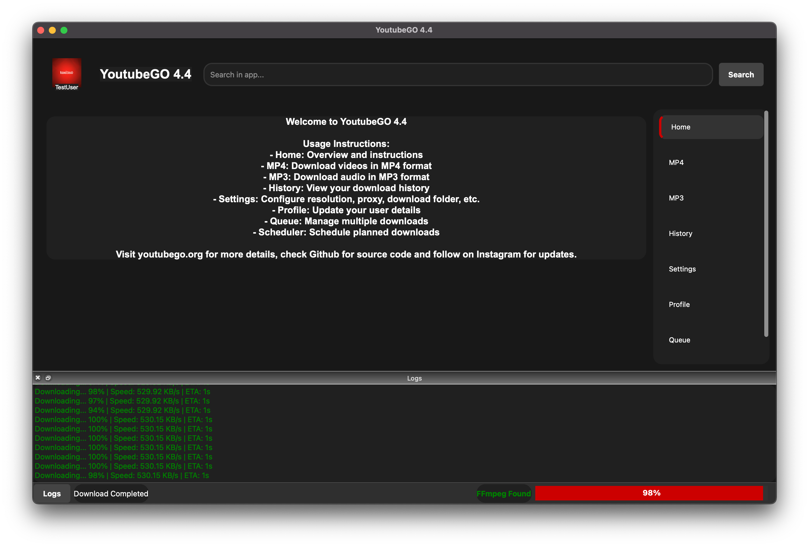

# 🎶 YoutubeGO 4.4 🎥
[](https://www.python.org/)
[](LICENSE)
[]()


YoutubeGO 4.4 is a **free, fast, and secure** multimedia downloader built with **Python** and **PyQt5**, now with a **modular structure** for better maintainability and scalability. It includes robust functionality such as **profile management**, **FFmpeg detection**, **scheduler for planned downloads**, **drag-and-drop support**, **enhanced queue system**, and **system tray support**.

[](https://youtubego.org)
[](https://discord.gg/DasCasQWCt)

[🇷🇺 Русский](README.ru.md)
## 🌟 Key Features

- **Multi-Platform Support**  
  Download videos and audio from platforms supporting HTTP streams, including YouTube, Vimeo, and more.

- **Playlist Downloads**  
  Save entire playlists with sequential processing in just a few clicks.

- **Multiple Formats**  
  Download in **MP4** (video) and **MP3** (audio) formats with automatic conversion and merging.

- **High-Resolution Support**  
  Supports downloads up to **8K, 4K, 2K, 1080p, 720p, 360p**. Select your preferred resolution in Settings.

- **Batch Processing**  
  Queue multiple downloads and manage them simultaneously. Pause, resume, or cancel downloads easily.

- **Audio Extraction**  
  Extract audio tracks in **MP3** format, ideal for music or podcasts. (Requires **FFmpeg**.)

- **Profile Management**  
  Save your name, profile picture, download paths, and social media links. Profiles can be updated directly in the app.

- **Drag & Drop Interface**  
  Add download URLs by dragging them into the app.

- **Dark & Light Mode**  
  Switch between Dark and Light themes for better usability.

- **Error Handling**  
  Displays detailed error logs to debug issues.

- **Scheduler**  
  Schedule downloads to start at a specific time.

- **Download History**  
  View, search, and manage previous downloads directly in the app.

- **FFmpeg Detection**  
  Automatically detects FFmpeg installation and prompts for setup if missing.

- **Cross-Platform Compatibility**  
  Fully supported on **Linux**, **macOS**, and **Windows**.

---



## 🚀 New in Version 4.4

### 🔥 Modular Codebase
- **Code has been fully refactored** into `core/`, `ui/`, and `tests/` directories.
- Easier to maintain, extend and contribute.

### 🔥 System Tray Integration
- Application now runs in the **system tray** when minimized.
- Quick access menu to restore or quit the app.

### 🔥 Improved Notification System
- **Download Complete** notifications.
- **Download Failed** alerts.
- **Download Canceled** warnings.

### 🔥 Enhanced Download System
- Fixed issues with **large file downloads**.
- Improved **stability and efficiency**.
- Better support for **multiple simultaneous downloads**.

### 🔥 Profile Management Upgrades
- Store your **name, profile picture, and social media links**.
- Improved UI for editing and updating user details.

### 🔥 Queue System Optimization
- **Concurrency management**: Limit simultaneous downloads.
- **Pause & Resume All**: Manage queued downloads easily.
- **Bandwidth Limiting Support** (via proxy settings).

### 🔥 Scheduler for Planned Downloads
- Schedule downloads for a specific **date and time**.
- Improved UI for managing scheduled downloads.

### 🔥 Other Improvements
- **Better UI animations and responsiveness.**
- **Logs now include color-coded messages**.
- **Search & filter options** in history and queue.

---

## ⚙️ Installation

```bash
# Clone the repository
git clone https://github.com/Efeckc17/YoutubeGO.git
cd YoutubeGO

# Ensure Python 3.7+ is installed
python --version

# Install dependencies
pip install -r requirements.txt

# Install FFmpeg for audio and video processing

# macOS
brew install ffmpeg

# Linux (Debian/Ubuntu)
sudo apt install ffmpeg

# Linux (Arch-based)
sudo pacman -S ffmpeg

# Windows (via winget)
winget install FFmpeg
```

---

## 🔧 Usage

```bash
# Launch the app
python main.py
```

- Configure your profile in the **Settings** or **Profile** page.
- Use the MP4 or MP3 pages to download videos or extract audio.
- Add multiple downloads to the queue and manage them from the Queue page.
- Schedule downloads in advance using the Scheduler.

---

## ⚠️ Notes

```bash
# FFmpeg Required
# Some features, like audio extraction and video merging, depend on FFmpeg.
# Ensure it’s installed and available in your system PATH.

# Third-Party Libraries
# The app uses yt_dlp for downloading and metadata extraction.
# Refer to their GitHub page for details.
https://github.com/yt-dlp/yt-dlp
```

---

## 🙏 Contributions

```bash
# We welcome contributions to improve YoutubeGO 4.4.
# Please submit issues or pull requests via GitHub.

# Enjoy using YoutubeGO 4.4!
🚀
```

```bash
# License
# This project is licensed under the Apache License 2.0.
```

