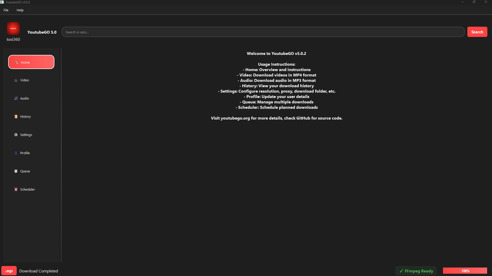
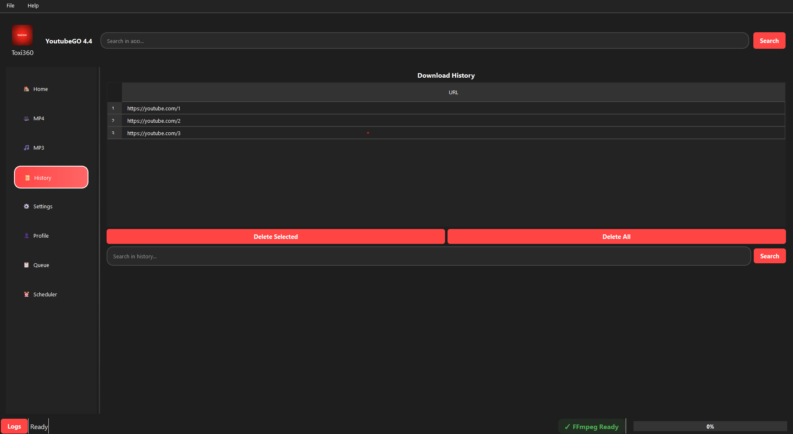
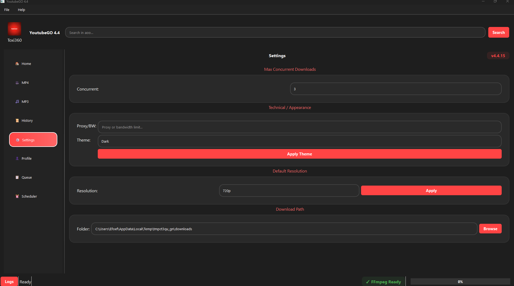

# 🎶 YoutubeGO 4.4 🎥

### 🛠️ Технологии

[](https://www.python.org/)
[](https://pypi.org/project/PyQt5/)
[](https://github.com/yt-dlp/yt-dlp)
[](https://pypi.org/project/requests/)
[](https://ffmpeg.org/)


### 📊 Статистика проекта
[](https://github.com/Efeckc17/YoutubeGO)
[](https://github.com/Efeckc17/YoutubeGO/commits)
[](https://github.com/Efeckc17/YoutubeGO/stargazers)
[](https://github.com/Efeckc17/YoutubeGO/network/members)


### 📜 Юридическая
[](LICENSE)

### 🌐 Ссылки
[](https://youtubego.org)
[](https://discord.gg/XdK97UH3fE)

## 🌐 Языки

| 🇬🇧 [English](README.md)

## 🌟 Основные возможности

### 🎯 Основные функции
- **Поддержка нескольких платформ**  
  Загружайте видео и аудио с платформ, поддерживающих HTTP-потоки, включая YouTube, Vimeo и другие.

- **Загрузка плейлистов**  
  Сохраняйте целые плейлисты с последовательной обработкой всего за несколько кликов.

- **Разные форматы**  
  Загрузка в формате **MP4** (видео) и **MP3** (аудио) с автоматической конверсией и объединением.

- **Поддержка высокого разрешения**  
  Поддерживает загрузку до **8K, 4K, 2K, 1080p, 720p, 360p**. Выберите нужное разрешение в настройках.

### 🛠️ Расширенные функции
- **Пакетная обработка**  
  Очередь нескольких загрузок и их одновременное управление. Приостановка, возобновление и отмена загрузок.

- **Извлечение аудио**  
  Извлечение аудиодорожек в формате **MP3**, идеально подходит для музыки или подкастов (требуется **FFmpeg**).

- **Управление профилем**  
  Сохраните своё имя, аватар, путь загрузки и ссылки на соцсети. Всё можно изменить в приложении.

- **Импорт/Экспорт профиля**  
  Легко экспортируйте свой профиль, настройки, историю и аватар в один ZIP-файл и импортируйте их обратно в приложение на любом устройстве. Удобно для резервного копирования, переноса или восстановления ваших предпочтений.

- **Интерфейс Drag & Drop**  
  Добавляйте ссылки для загрузки простым перетаскиванием.

### 🎨 Пользовательский опыт
- **Тёмный и светлый режимы**  
  Переключение между темной и светлой темой для удобства.

- **Обработка ошибок**  
  Подробные сообщения об ошибках для диагностики.

- **Планировщик загрузок**  
  Установите время начала загрузки.

- **История загрузок**  
  Просматривайте, ищите и управляйте прошлыми загрузками прямо в приложении.

### 🔧 Технические особенности
- **Обнаружение FFmpeg**  
  Автоматически находит FFmpeg и предлагает настройку при необходимости.

- **Кроссплатформенность**  
  Полностью поддерживается на **Linux**, **macOS** и **Windows**.

## 🚀 Новое в версии 4.4

### 🔥 Модульная структура кода
- Полный рефакторинг с разделением на `core/`, `ui/` и `tests/`.
- Упрощение поддержки и развития проекта.

### 🔥 Интеграция с системным треем
- Приложение сворачивается в трей.
- Быстрое восстановление или завершение работы через меню.

### 🔥 Улучшенная система уведомлений
- Уведомления о завершении загрузки.
- Ошибки загрузки.
- Предупреждения об отмене.

### 🔥 Улучшенная система загрузки
- Исправлены проблемы с загрузкой больших файлов.
- Повышена стабильность и эффективность.
- Лучшая поддержка многопоточных загрузок.

### 🔥 Улучшения профилей
- Хранение имени, аватара и соцсетей.
- Улучшенный UI для редактирования.

### 🔥 Оптимизация очереди
- Управление параллельными загрузками.
- Приостановка/возобновление всех задач.
- Поддержка ограничения пропускной способности (через прокси).

### 🔥 Планировщик загрузок
- Загрузка по определённой **дате и времени**.
- Новый интерфейс управления.

### 🔥 Другие улучшения
- Анимации и отклик интерфейса.
- Цветная система логов.
- Поиск и фильтрация в истории и очереди.

## 📸 Скриншоты

<div align="center">
  
  
  
</div>

## ⚙️ Установка

```bash
# Клонировать репозиторий
git clone https://github.com/Efeckc17/YoutubeGO.git
cd YoutubeGO

# Убедитесь, что установлен Python 3.7+
python --version

# Установить зависимости
pip install -r requirements.txt

# Установить FFmpeg для обработки видео и аудио

# macOS
brew install ffmpeg

# Linux (Debian/Ubuntu)
sudo apt install ffmpeg

# Linux (Arch)
sudo pacman -S ffmpeg

# Windows (winget)
winget install FFmpeg
```

## 🔧 Использование

```bash
# Запустить приложение
python main.py
```

- Настройте профиль в разделе **Settings** или **Profile**.
- Выберите режим MP4 или MP3 для загрузки.
- Добавьте несколько загрузок в очередь.
- Используйте планировщик для будущих загрузок.

## ⚠️ Примечания

```bash
# Требуется FFmpeg
# Некоторые функции, такие как извлечение аудио и объединение видео, требуют FFmpeg.

# Сторонние библиотеки
# Приложение использует yt_dlp для загрузки и получения метаданных.
# Подробнее: https://github.com/yt-dlp/yt-dlp
```

## 🙏 Вклад

```bash
# Мы приветствуем участие в развитии YoutubeGO 4.4.
# Пожалуйста, создавайте Issues или Pull Requests на GitHub.

# Наслаждайтесь использованием YoutubeGO 4.4!
🚀
```

```bash
# Лицензия
# Этот проект лицензирован под Apache License 2.0.
```

## ⚠️ Юридическое уведомление

YoutubeGO — это независимый проект с открытым исходным кодом. Он работает независимо от YouTube и Google, выполняя загрузки и другие операции без использования их API. Этот проект не связан условиями использования или правилами YouTube.
